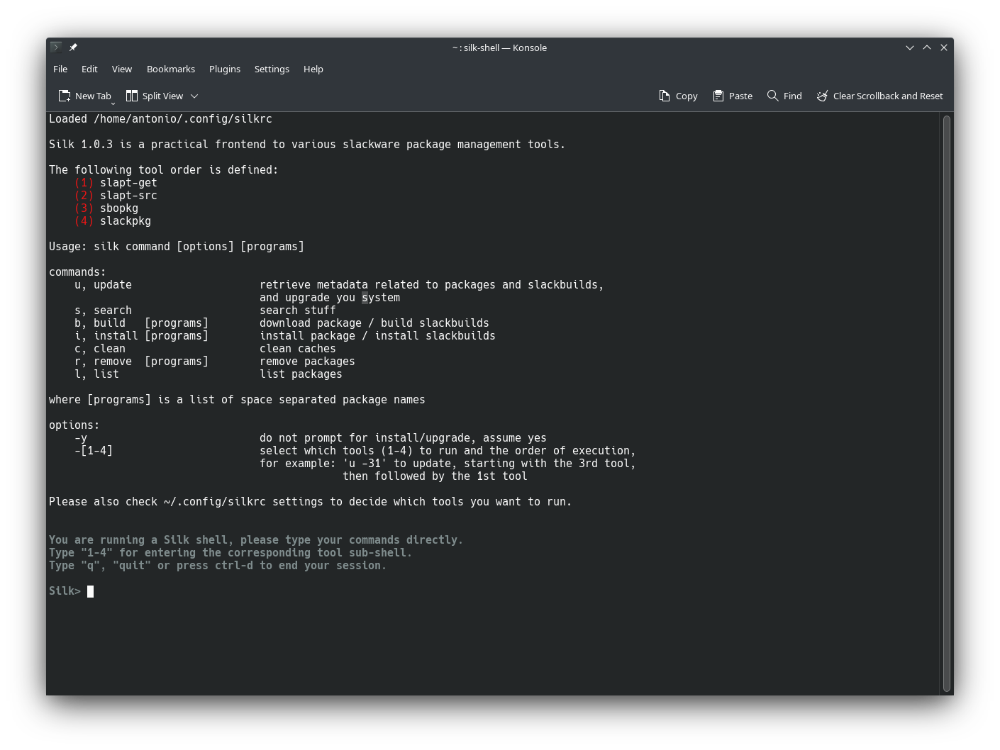

# Less Typing with Silk...

## Description

Silk is a practical front end to various slackware package management
tools, namely slackpkg, sbopkg, slapt-get and slapt-src.
It implements the more common commands and simplifies the operation
of multiple programs by unifying their syntax and execution. The idea is to handle all just as 'packages', independently if they are distributed as binary or source, and manage them through a simple and fast user interface.

You do not need to be root to run Silk, the program will ask the su password when needed.

command-line usage examples:

    silk u         --> update and upgrade installed programs and
                       slackbuilds
    silk s 'name'  --> search for a package or slackbuild 'name'
    silk i 'name'  --> install 'name'
    silk r 'name   --> remove name

A launcher is installed in the programs menu for silk-shell,
which streamlines operations even more. In this case you can type the commands
directly at the "Silk>" prompt, for example:

    Silk> u

The silk-shell Main window:

Search results of command "s ardour":

Each tool sub-shell is enabled by pressing the corresponding tool number 1-4.
Once inside the sub-shell the usage is similar to the main shell.

Notes:
  * 'sl' and 'slapt' are symlinks to 'silk'. Use them as aliases for 'silk'.
  * This program conflicts with the 'sl' package found in SlackBuilds.org, do not install both at the same time.

Silk is written in Python and is actually very simple. You can easily change it.

## Installation

To install Silk please type:

    sudo ./install.sh

Then please add your user to sudoers in order to use the program.

## (Optional) changing the silkrc file

sbopkg is disabled by default, if you have it installed you can
enable it in the config file ~/.config/silkrc:

    [settings]
    version = 1.0
    
    slapt-get-colors = BOLD CYAN
    slapt-src-colors = BOLD YELLOW
    sbopkg-colors = BOLD GREEN
    slackpkg-colors = BOLD BLUE
    
    # order of execution (write 0 to prevent running):
    slapt-get = 1
    slapt-src = 2
    sbopkg = 0
    slackpkg = 4

The *tool*-colors are first, the **mode** NORMAL, BOLD, LIGHT, ... followed by
the **color**, see the /usr/bin/silk program for the supported colors and modes.

The numbers in front of each *tool* refer to the execution priority,
'0' when a tool in disabled. For example you could change the '0' to '3'
to define that *sbopkg* is third in order.

**version** is the version of the silkrc file itself. Do not change it.

## Uninstallation

To delete Silk from your system please type:

    sudo ./uninstall.sh
